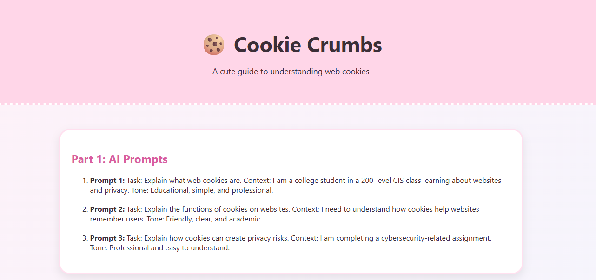
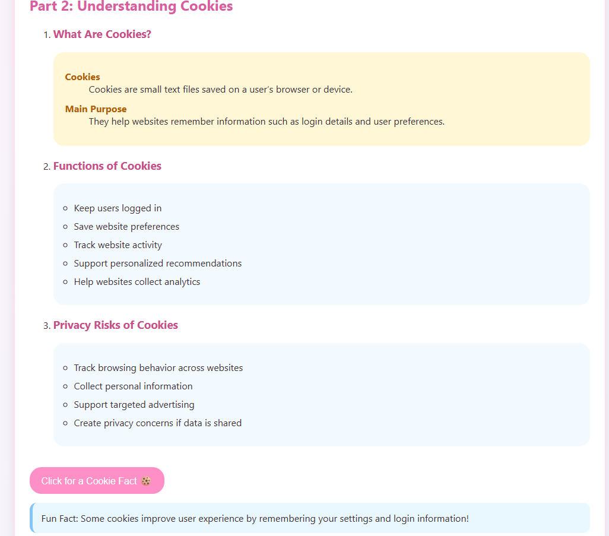
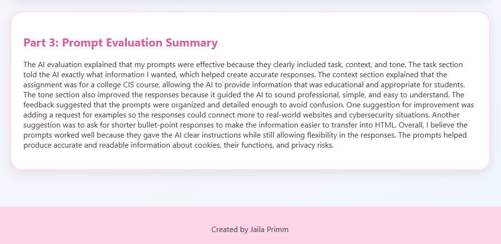

# Cookie Crumbs – Understanding Web Cookies

## Created By
Jaila Primm

## Course
Foundations of Information Systems

## Assignment Overview

This project was created for an assignment focused on understanding web cookies, their functions, and potential privacy risks. The webpage explains what cookies are, how websites use them, and how cookies may affect online privacy and security.

The project demonstrates the use of:

- HTML5
- CSS3
- JavaScript

The webpage was designed to be visually appealing, interactive, beginner-friendly, and easy to navigate.

---

# Project Screenshot






---

# Project Features

## HTML Features

The webpage includes the following required HTML tags:

- `<ul>`
- `<ol>`
- `<li>`
- `<dl>`
- `<dt>`
- `<dd>`

Additional semantic HTML elements used:

- `<header>`
- `<main>`
- `<section>`
- `<footer>`
- `<button>`

---

## CSS Features

The webpage uses CSS for:

- Gradient background styling
- Rounded card layouts
- Hover effects
- Responsive spacing
- Cute pastel color theme
- Shadows and borders for visual design

---

## JavaScript Features

JavaScript was used to:

- Create an interactive cookie fact button
- Show hidden content when the button is clicked
- Improve user interaction on the webpage

---

# Topics Covered

## What Are Cookies?
- Definition of web cookies
- Purpose of browser cookies
- How websites store user information

## Functions of Cookies
- Login sessions
- User preferences
- Website analytics
- Personalized content

## Privacy Risks
- User tracking
- Third-party cookies
- Data collection concerns
- Advertising tracking

---

# Folder Structure

```text
project-folder
│
├── index.html
├── style.css
├── script.js
├── README.md
│
└── images
    ├── 1.png
    ├── 2.png
    ├── 3.png
    └── video.gif
    

---

# Author Notes

This project helped strengthen my understanding of web cookies, browser privacy, and basic front-end web development. It also improved my experience using prompt engineering and organizing information into a creative webpage format.